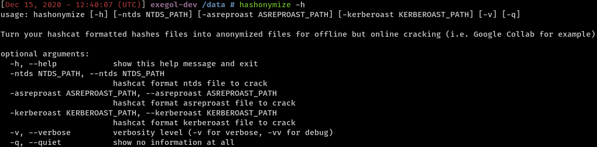
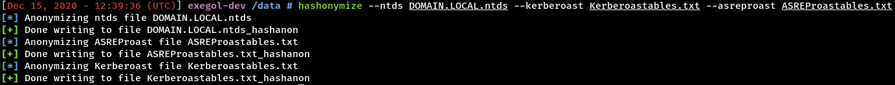
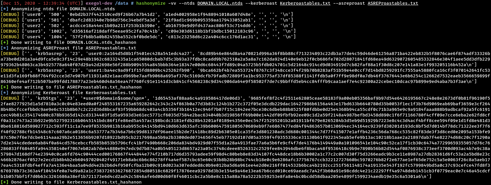

# Hashonymize

This smol tool is aimed at anonymizing hashes files for offline but online cracking like Google Collab for instance (see https://github.com/mxrch/penglab).

This is the help.

This is how it works.

This is how it works in debug.

This script is really simple, really dumb, improve it if you want improvements.